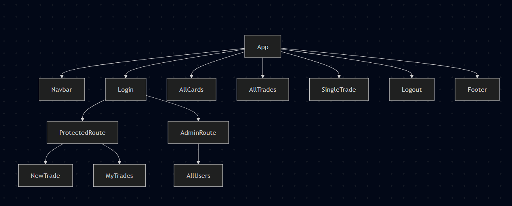
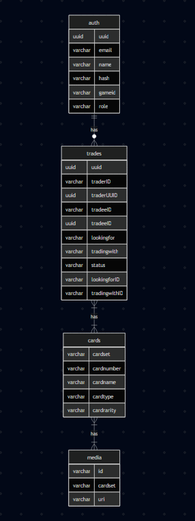

# Abstract

Pockethub is a full stack webpage to facilitate the trading of cards in the game [Pokémon TCG Pocket](https://tcgpocket.pokemon.com/en-us/).

> As this is a currently a student project, only the cards from set A1 are availble to trade.

[Trello board](https://trello.com/b/6gqlg9CJ/pockethub)

# Attributions

The literal and graphical information presented on this website about the Pokémon Trading Card Game Pocket, including card images and text, is copyright The Pokémon Company, DeNA Co., Ltd., and/or Creatures, Inc.. This website is not produced by, endorsed by, supported by, or affiliated with any of those copyright holders.

# React Component Tree

# Database schema diagram

# Technologies used

## Frontend

- React
- React Router
- Tanstack Query
- Bootstrap
- Bootstrap React
- jwt-decode

## Backend

- Flask
- psycopg2
- flask-cors
- python-dotenv
- bcrypt
- flask-jwt-extended

# Next steps:

The stretch goals will improve on the current known limitations of the website, including

- Admins having more power over users
- The ability to change gameID and password after account creation
- Not being able to trade with yourself
